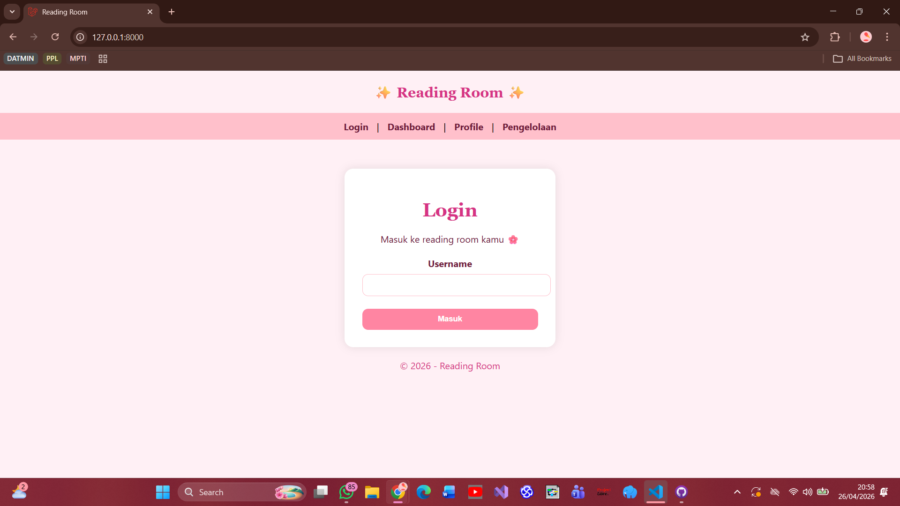
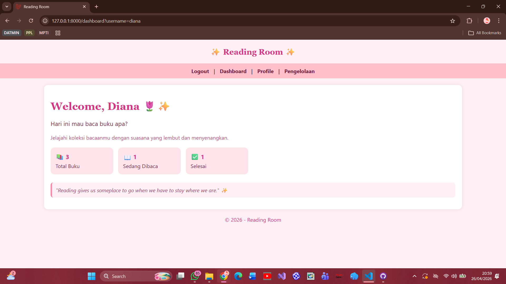
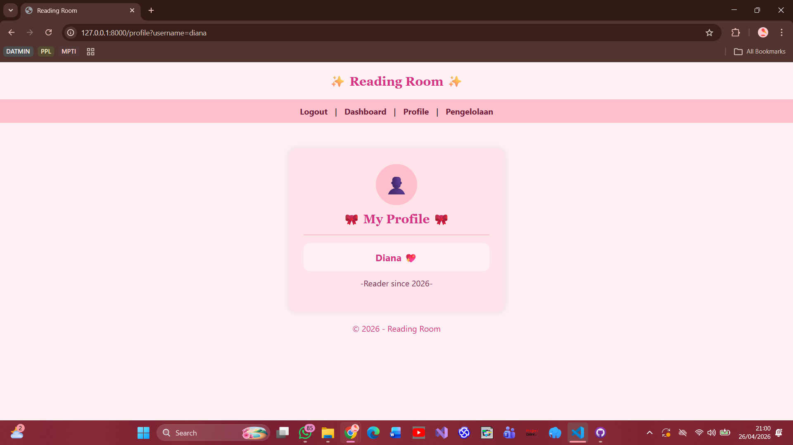
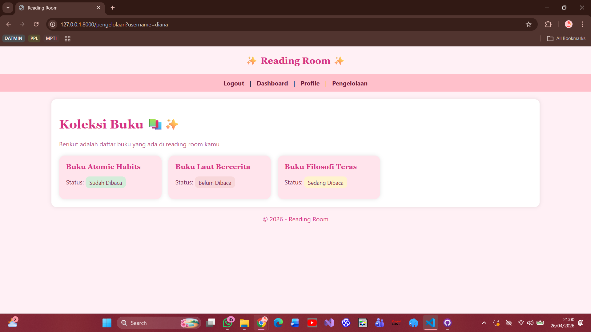

# UTS PWEB

## Deskripsi
Website ini merupakan aplikasi pengelolaan buku sederhana yang dibuat menggunakan framework Laravel. 
Pengguna dapat melakukan login dengan memasukkan username, kemudian mengakses halaman dashboard, profile, dan pengelolaan buku. 
Pada halaman pengelolaan, ditampilkan daftar buku beserta statusnya seperti sudah dibaca, sedang dibaca, atau belum dibaca. 

## Fitur
- Login
- Dashboard
- Profile
- Pengelolaan buku

## Screenshot

### Login

### Dashboard

### Profile

### Pengelolaan

